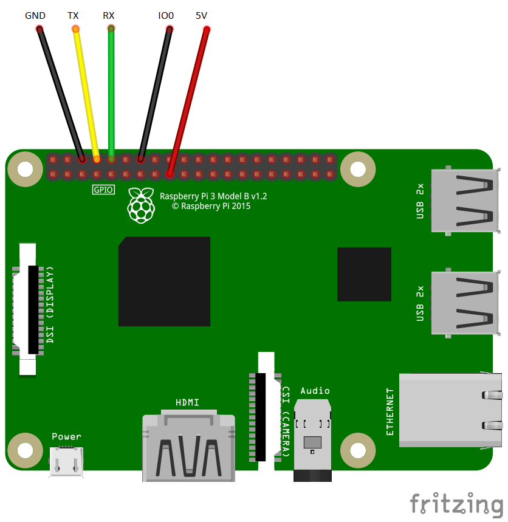

# ESPeasy auf ESP8266 mit Raspberry Pi flashen
Wenn gerade USB-UART Kabel zur Hand ist, kann ESPeasy mithilfe eines Raspberry Pi geflasht werden. Der Raspberry Pi muss dazu vorbereitet werden. Anschließen kann der ESP8266 angeschlossen werden und ESPeasy geflasht werden.

## Vorbereitung RaspberryPi
1. Im Terminal muss die Serielle Anmeldung deaktiviert werden:
    ```sh
    sudo raspi-config
    => Interface Options
    => Serial Port
    ```
2. Would you like a login shell to be accessible over serial? => **NO**
3. Would you like the serial port hardware to be enabled? => **YES**
4. Restart pi

## Python ESPtool installieren
1. PIP aktualisieren
    ```sh
    python3 -m pip install --upgrade pip
    ```
2. ESPtool installieren
    ```sh
    sudo pip install esptool
    ```

## Verkabelung RaspberryPi <-> ESP8266
Die Kommunikation sieht einen *reveiving* und einen *transmitting* pin vor. Receiving am Pi muss zu Transmitting am ES8266. Folgendes Bild zeigt die Anschlüsse für einen ESP8266 aus Sicht des RaspberryPi


## Flashen der Firmware
Der ESP8266 bekommt am RaspberryPi eine der folgenden Adressen: 
  - /dev/ttyS0
  - /dev/ttyAMA0

0. Adresse prüfen und Daten auslesen
    ```sh
    esptool.py --port /dev/ttyS0 flash_id
    ```
1. Flash löschen
    ```sh
    esptool.py --port /dev/ttyS0 erase_flash
    ```
2. Neue Firmware flashen
    ```sh
    esptool.py --port /dev/ttyS0 write_flash -fs 4MB -fm dout 0x00000 ESP_Easy_mega_**xxxxx**_normal_ESP8266_4M1M.bin
    ```
    
### Download der Firmware
Die Firmware kann über [Github](https://github.com/letscontrolit/ESPEasy/releases) heruntergeladen werden.
Nach dem Download in den **bin** Ordner und dort die passende Firmware entpacken (in der Regel ..._normal_ESP8266_4M1M.bin)
